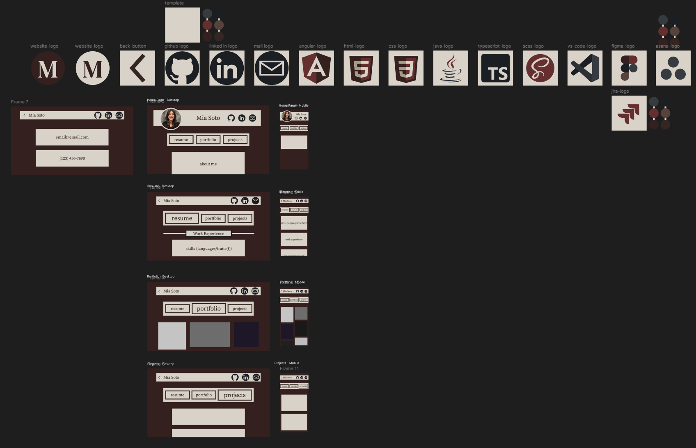

# Angular Resume Website

This project was created as a way to showcase my personal resume in a more interactive form. Through custom layouts and personalized styling, a viewer can become engaged and gain a better understanding of who I am! This is the first complex website with multiple assets and components that I have made, so it was a fun learning journey!

# Details

## Header & Navbar

My header and navbar element are shared components. I still wanted them to look a little different when on the home page, so I did that using

```html
<a
  routerLink="/"
  routerLinkActive
  #rla="routerLinkActive"
  [routerLinkActiveOptions]="{exact: true}"
>
  @if (rla.isActive) {
  
  } @else {
  
  }
</a>
```

for my header, and

```ts
ngOnInit() {
    this.router.events
      .pipe(filter((event): event is NavigationEnd => event instanceof NavigationEnd))
      .subscribe((event: NavigationEnd) => {
        this.isHomePage = event.url === '/';
      });
  }
```

for my navbar!

## Resume - Shared Components

My resume content blocks are actually set up through shared components in a .json file!

```json
"name": "Work Experience",
      "items": [
        {
          "order": 1,
          "type": "information",
          "title": "In-N-Out Burger",
          "subtitle": "Software Engineering Intern",
          "dateText": "Summer 2026",
          "content": ["As a temp-intern at In N Out Burger..."]
        }
```

Then, \_\_ displays a styled text box!

```html
@for(section of resumeSections(); track $index) {
<app-resume-section [resumeSection]="section"></app-resume-section>
}
```

## Portfolio

Similarly to my reume page, my artwork files are stored in a json file that is then ...

```ts
getImageFromFolder() {
    this.http.get<Array<string>>(resourceUrls.portfolioImageUrl).subscribe({
      next: (value) => {
        this.images.set(value);
        console.log(this.images());
      },
```

## Favorite Features

The most fun I had was with the links in my header! I enjoyed making them jump as you hover over them.

I also used Figma to create each icon you see on my page! It was also a huge help when it came to planning the design of my entire website.



# MiaSoto

This project was generated using [Angular CLI](https://github.com/angular/angular-cli) version 21.2.16.

## Development server

To start a local development server, run:

```bash
ng serve
```

Once the server is running, open your browser and navigate to `http://localhost:4200/`. The application will automatically reload whenever you modify any of the source files.

## Code scaffolding

Angular CLI includes powerful code scaffolding tools. To generate a new component, run:

```bash
ng generate component component-name
```

For a complete list of available schematics (such as `components`, `directives`, or `pipes`), run:

```bash
ng generate --help
```

## Building

To build the project run:

```bash
ng build
```

This will compile your project and store the build artifacts in the `dist/` directory. By default, the production build optimizes your application for performance and speed.

## Running unit tests

To execute unit tests with the [Vitest](https://vitest.dev/) test runner, use the following command:

```bash
ng test
```

## Running end-to-end tests

For end-to-end (e2e) testing, run:

```bash
ng e2e
```

Angular CLI does not come with an end-to-end testing framework by default. You can choose one that suits your needs.

## Additional Resources

For more information on using the Angular CLI, including detailed command references, visit the [Angular CLI Overview and Command Reference](https://angular.dev/tools/cli) page.
